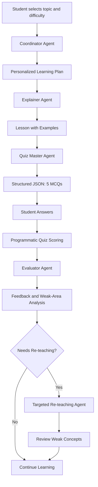

# Leo — Multi-Agent AI Tutor 🎓

**An AI-powered learning assistant that plans, teaches, quizzes, evaluates, and provides personalized feedback through specialized AI agents.**

<p align="center">
  
  
  
  
  
  
</p>

## 📌 Overview

**Leo — Multi-Agent AI Tutor** is an AI-powered educational assistant built with CrewAI, Google Gemini, and Gradio. It uses multiple specialized AI agents that collaborate through a sequential learning workflow instead of relying on a single general-purpose chatbot.

Students can choose a topic, select a difficulty level, receive a personalized learning plan, study an AI-generated lesson, answer a five-question multiple-choice quiz, and receive performance-based feedback.

When a student struggles with specific concepts, Leo can generate a targeted re-teaching lesson based on the identified weak areas.

The project was developed as a practical implementation of multi-agent orchestration, role-specific prompt engineering, session memory, structured output validation, and interactive AI applications.

## ✨ Key Features

- **Multi-agent architecture:** Specialized agents handle planning, teaching, assessment, evaluation, and targeted re-teaching.
- **Sequential orchestration:** Each stage uses outputs from the previous stage.
- **Personalized learning:** Learning content is adapted to the student's selected topic and difficulty level.
- **Structured quiz generation:** The Quiz Master produces exactly five MCQs with four options per question.
- **Answer evaluation:** Quiz answers are checked programmatically, with a verified score and percentage.
- **Personalized feedback:** The Evaluator analyzes performance and identifies concepts that need further review.
- **Targeted re-teaching:** A dedicated agent creates a mini-lesson for identified weak areas.
- **Session memory:** Student information, topic, learning plan, quiz results, feedback, and activity history are maintained during the session.
- **Interactive interface:** Gradio provides inputs, learning materials, quiz controls, results, and an agent activity log.
- **Error handling:** Application callbacks handle invalid inputs and agent execution errors.
- **Secure API-key handling:** Google Colab Secrets is used to access the Gemini API key without hardcoding it in the notebook.

## 🏗️ Architecture

Leo follows a sequential multi-agent workflow.



### How the agents collaborate

1. The **Coordinator Agent** analyzes the student's request and creates a structured learning plan.
2. The **Explainer Agent** receives the selected topic and learning plan, then prepares the lesson.
3. The **Quiz Master Agent** uses the lesson as context and generates a structured five-question quiz.
4. The student submits answers through the Gradio interface.
5. The application checks the answers and calculates the verified score.
6. The **Evaluator Agent** receives the score, answer-level results, weak areas, and lesson context to generate feedback.
7. The **Targeted Re-teaching Agent** uses the evaluation results to prepare additional explanations and practice activities for weak concepts.

The main agent outputs are passed to downstream stages as task inputs. Quiz scoring is performed in Python so that the LLM does not determine or alter the verified score.

## 🤖 Agent Roles

### 1. Coordinator Agent

**Role:** Learning Coordinator

**Responsibility:**
- Understand the student's learning request.
- Identify learning objectives and prerequisites.
- Organize subtopics in a logical order.
- Create a personalized learning plan.
- Define expected learning outcomes and assessment goals.

**Input:** Student name, topic, and difficulty level.

**Output:** Structured learning plan.

### 2. Explainer Agent

**Role:** Concept Explainer

**Responsibility:**
- Explain the selected topic in an accessible way.
- Follow the Coordinator's learning plan.
- Provide step-by-step explanations and practical examples.
- Highlight common mistakes.
- Summarize the key concepts.

**Input:** Student information, topic, difficulty, and Coordinator's plan.

**Output:** A structured lesson with examples and a recap.

### 3. Quiz Master Agent

**Role:** Quiz Master

**Responsibility:**
- Generate exactly five multiple-choice questions.
- Create four options for each question: A, B, C, and D.
- Include a correct answer key, topic label, and explanation.
- Structure the response as JSON.
- Validate the generated questions before displaying them.

**Input:** Student information, difficulty level, and lesson content.

**Output:** A validated list of five MCQs.

**Example output structure:**

```json
{
  "questions": [
    {
      "question": "What is a Python variable?",
      "options": {
        "A": "A named reference to a value",
        "B": "A type of loop",
        "C": "A database table",
        "D": "A Python package"
      },
      "answer": "A",
      "topic": "Python Basics",
      "explanation": "A variable name is used to refer to a value."
    }
  ]
}
```

*The example illustrates the structure of one question. The application validates that the complete quiz contains exactly five questions.*

### 4. Evaluator Agent

**Role:** Quiz Evaluator

**Responsibility:**
- Review the student's verified quiz results.
- Explain incorrect answers.
- Identify concepts that need improvement.
- Highlight correctly understood concepts.
- Provide constructive and actionable feedback.

**Input:** Student answers, programmatically calculated score, question-level results, weak areas, and lesson context.

**Output:** Personalized evaluation and recommendations for further study.

### 5. Targeted Re-teaching Agent

**Role:** Targeted Re-teaching Specialist

**Responsibility:**
- Focus on concepts the student answered incorrectly.
- Explain difficult ideas in smaller steps.
- Use alternative examples and analogies.
- Explain common sources of confusion.
- Provide short practice activities and a recap.

**Input:** Identified weak areas and incorrect-answer details.

**Output:** A targeted mini-lesson.

The first four agents implement the assignment's core roles. The re-teaching agent is an additional specialized component.

## 🔄 Orchestration Pattern

Leo uses a **sequential orchestration pattern** implemented with CrewAI.

The main learning workflow is:

`Coordinator → Explainer → Quiz Master → Student → Evaluator → Re-teaching`

Each stage receives relevant context from previous stages. The Coordinator prepares the learning plan, the Explainer uses that plan, and the Quiz Master uses the lesson to create assessment questions. The Evaluator receives the verified quiz results after the student submits answers.

Specialized tasks are executed through CrewAI crews. The implementation uses separate agent-task executions for different stages, rather than a single hierarchical manager crew.

## 🧠 Memory Management

Leo maintains session-level memory using a Python dictionary and Gradio state.

The session stores information such as:

- Student name
- Selected learning topic
- Difficulty level
- Learning plan
- Lesson content
- Quiz questions
- Submitted answers
- Quiz score
- Evaluator feedback
- Identified weak areas
- Re-teaching attempts
- Session activity history and timestamps

This information supports continuity between stages of the current tutoring session.

**Memory limitation:** The current implementation uses session memory. It does not provide permanent database storage or guarantee that student history will persist after a session or runtime is reset.

## 📝 Prompt Engineering

Each specialized agent has its own role, goal, backstory, and task-specific instructions.

The prompts define the agent's responsibilities, the context it receives, the output expected from it, and the constraints it must follow.

Examples include:

- The Coordinator must create a learning plan without generating the quiz.
- The Explainer must follow the plan and avoid revealing upcoming quiz answers.
- The Quiz Master must return exactly five MCQs in a specified JSON structure.
- The Evaluator must use the verified score and must not invent or change answer results.
- The Re-teaching Agent must focus on the student's identified weak areas.

This role-based prompt design helps separate responsibilities and makes the workflow easier to maintain.

## 🛠️ Technology Stack

| Technology | Purpose |
|---|---|
| Python | Application logic and orchestration |
| CrewAI | AI-agent and task coordination |
| Google Gemini | Language model for agent tasks |
| Gemini 3.1 Flash-Lite | Configured model identifier |
| Gradio | Interactive web interface |
| JSON | Structured quiz output |
| Python regular expressions | Extracting JSON from model responses |
| Google Colab | Development and execution environment |
| Google Colab Secrets | Secure API-key access |

## 📁 Project Structure

The current project is organized around a Google Colab notebook.

```text
Leo-Multi-Agent-AI-Tutor/
│
├── Leo_AI_Tutor.ipynb   # Main application and agent workflow
├── README.md            # Project documentation
├── requirements.txt     # Python dependencies
└── .gitignore           # Files excluded from version control
```

`README.md`, `requirements.txt`, and `.gitignore` are recommended repository files; they should be created separately if they are not already present in the repository.

## ⚙️ Installation and Setup

### Prerequisites

Before running the project, prepare:

- A Google account with access to Google Colab.
- A Gemini API key from Google AI Studio.
- Access to the configured Gemini model.
- An internet connection for dependency installation and API requests.

The configured model is `gemini/gemini-3.1-flash-lite`. Model availability, account access, quotas, and API charges depend on the provider's current terms and account settings.

### Option 1: Run in Google Colab

**Step 1 — Open the notebook**

Upload `Leo_AI_Tutor.ipynb` to Google Colab, or open the notebook from your GitHub repository.

**Step 2 — Add the Gemini API key**

1. Open Google Colab.
2. Select the **Secrets** panel.
3. Create a secret named `GEMINI_API_KEY`.
4. Paste your Gemini API key into the secret value.
5. Enable notebook access for that secret.

Do not publish your API key in your notebook, README, screenshots, or GitHub repository.

**Step 3 — Install dependencies**

Run the notebook's installation cell:

```python
%pip -q install -U crewai gradio
```

**Step 4 — Configure the model**

The notebook loads the key from Colab Secrets and configures CrewAI:

```python
import os
from google.colab import userdata
from crewai import Agent, Task, Crew, Process, LLM

GEMINI_API_KEY = userdata.get("GEMINI_API_KEY")

if not GEMINI_API_KEY:
    raise ValueError(
        "GEMINI_API_KEY is missing. "
        "Add it in Google Colab Secrets and enable notebook access."
    )

os.environ["GEMINI_API_KEY"] = GEMINI_API_KEY

MODEL_NAME = "gemini/gemini-3.1-flash-lite"

gemini_llm = LLM(
    model=MODEL_NAME,
    api_key=GEMINI_API_KEY,
    temperature=0.2,
)
```

**Step 5 — Run the notebook cells in order**

Execute the cells from top to bottom. The notebook tests model access, initializes the agents, defines the workflow, creates the Gradio interface, and launches the application.

**Step 6 — Open the Gradio interface**

When the launch cell finishes, open the Gradio URL provided by Colab.

The shared URL is temporary and should not be treated as a permanent deployment.

### Option 2: Clone the GitHub repository

After publishing the project, clone it with:

```bash
git clone https://github.com/YOUR_USERNAME/Leo-Multi-Agent-AI-Tutor.git
cd Leo-Multi-Agent-AI-Tutor
```

Replace `YOUR_USERNAME` with your GitHub username.

The current notebook relies on `google.colab.userdata`, so it is designed primarily for Google Colab. Running it outside Colab requires adapting the secret-loading code and ensuring the required dependencies and API configuration are available.

## 📦 Dependencies

Create a `requirements.txt` file containing:

```text
crewai
gradio
```

These are the primary packages installed by the current notebook. Google Colab supplies the `google.colab.userdata` module in its environment.

For reproducible installations, test the project and pin compatible dependency versions after confirming which versions work with the notebook.

## 🚀 How to Use Leo

1. Open the Leo Gradio interface.
2. Enter your name.
3. Enter a topic, such as Python, RAG, or Machine Learning.
4. Select Beginner, Intermediate, or Advanced difficulty.
5. Click **Start Learning Session**.
6. Review the Coordinator's learning plan.
7. Study the lesson prepared by the Explainer.
8. Read and answer the five MCQs.
9. Click **Submit Answers**.
10. Review your score, answer explanations, and Evaluator feedback.
11. If necessary, click **Re-teach My Weak Areas** to receive targeted learning material.

The interface includes an agent activity log to show the stages of the tutoring workflow.

## 🛡️ Error Handling and Validation

The application includes safeguards such as:

- Checking that the student name and learning topic are provided.
- Validating quiz JSON before displaying questions.
- Checking that exactly five questions are generated.
- Checking that each question contains four options and a valid answer key.
- Requiring an answer for each of the five quiz questions.
- Preventing quiz evaluation before a session has started.
- Handling exceptions in the Gradio callbacks.
- Limiting re-teaching attempts within the current session.

If an error occurs, review the status message and notebook output. Model-access issues, quota limits, invalid API keys, dependency conflicts, or malformed model output may still require troubleshooting.

## 🧪 Testing Checklist

Before submitting the project, run these checks in Google Colab.

- [ ] Dependencies install successfully.
- [ ] The Gemini API key loads from Colab Secrets.
- [ ] The configured model responds to the connection test.
- [ ] The Coordinator produces a learning plan.
- [ ] The Explainer uses the plan to generate a lesson.
- [ ] The Quiz Master returns exactly five valid MCQs.
- [ ] Invalid quiz structures are rejected.
- [ ] The student can answer all five questions.
- [ ] Programmatic scoring matches the answer key.
- [ ] The Evaluator produces feedback using the verified results.
- [ ] Weak areas are identified when answers are incorrect.
- [ ] The re-teaching agent generates targeted learning material.
- [ ] The Gradio interface displays agent activity and results.
- [ ] Missing inputs and runtime errors are handled clearly.

**Testing note:** These are recommended validation steps, not a claim that every test has passed in every environment.

## 🔐 Security and Privacy

- Store the Gemini API key in Google Colab Secrets or an appropriate environment variable.
- Never commit API keys, access tokens, or private credentials.
- Avoid including personal or sensitive student information in public repositories.
- Review notebook outputs before committing them to GitHub.
- Remove temporary shared URLs and unnecessary execution outputs when preparing a clean public notebook.

## ⚠️ Current Limitations

The current notebook has the following limitations:

1. **Session-only memory:** No permanent database or cross-session student profile is implemented.
2. **Retake workflow:** Re-teaching is available, but an automatic new quiz immediately after re-teaching is not currently implemented.
3. **Recovery behavior:** Callback-level exception handling is implemented, but a comprehensive Coordinator-managed retry and clarification workflow can be added.
4. **Temporary hosting:** The Gradio share URL is temporary.
5. **External dependency:** Agent generation requires access to the configured Gemini model and a valid API key.
6. **Version compatibility:** CrewAI, Gradio, and model-provider behavior may change as dependencies are updated.

## 🔮 Future Improvements

Potential enhancements include:

- Add automatic quiz retakes after re-teaching.
- Implement Coordinator-led clarification for vague requests.
- Add bounded retries for invalid structured output and transient model errors.
- Add persistent student memory with SQLite or a database.
- Introduce tools such as a calculator or controlled web search.
- Add session export and learning-progress reports.
- Add automated tests for quiz validation, scoring, and workflow behavior.
- Pin tested dependency versions.
- Deploy a production version to a suitable hosting platform.
- Add authentication and appropriate privacy controls for multi-user use.

These are planned enhancements, not features claimed to be complete in the current notebook.


## 📚 Learning Objectives Demonstrated

This project demonstrates practical work with:

- Multi-agent AI application design.
- CrewAI agents, tasks, and sequential orchestration.
- Role-specific prompt engineering.
- Context passing between specialized agents.
- Structured JSON generation and validation.
- Programmatic evaluation of quiz answers.
- Session-level memory management.
- Error handling in an interactive application.
- Gradio interface development.
- Gemini API integration.

## 👨‍💻 Author

**Ferdaus Hossen**

Computer Science & Engineering student at Green University of Bangladesh and AI/ML Engineer.

- **GitHub:** [Ferdaus71](https://github.com/Ferdaus71)
- **LinkedIn:** [ferdaus71](https://www.linkedin.com/in/ferdaus71/)
- **Google Scholar:** [Research Profile](https://scholar.google.com/citations?user=7N3hKAgAAAAJ&hl=en)

## 📄 License

This project does not currently specify a license. If you want others to reuse or modify the code, add an appropriate open-source license file, such as an MIT License, after deciding on the intended permissions.

## 🙌 Acknowledgements

- CrewAI for multi-agent orchestration.
- Google Gemini for language-model capabilities.
- Gradio for the interactive user interface.
- Google Colab for notebook-based development.

---

**Leo — Multi-Agent AI Tutor**  
*Plan. Teach. Practice. Evaluate. Improve.*
